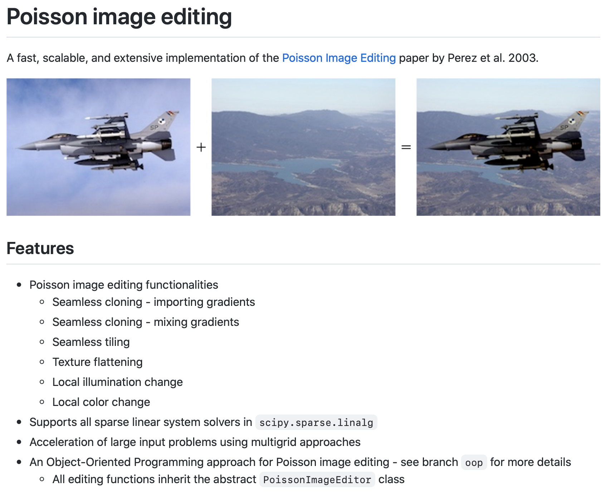
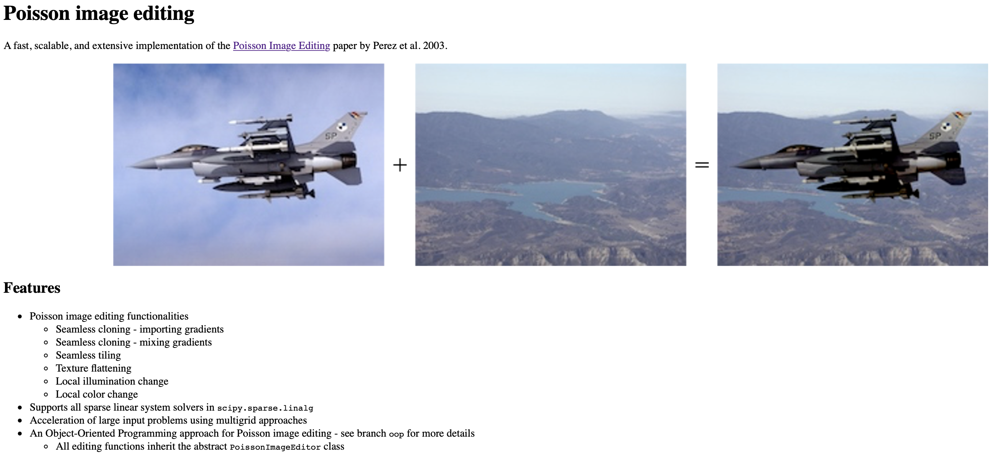
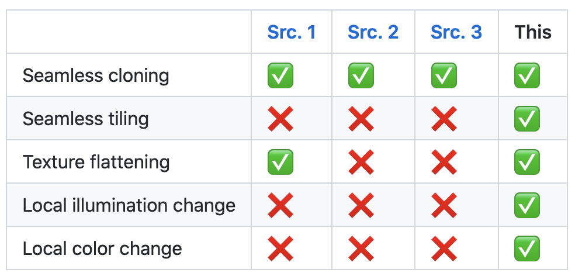
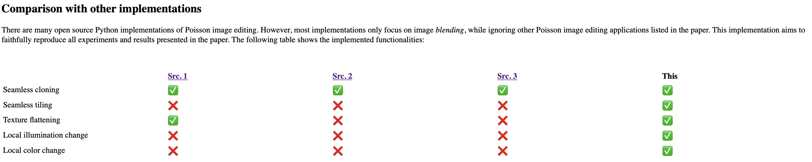

# extract-readme
`extract-readme` extracts the README markdown file from a GitHub repository and generates a corresponding formatted HTML that can be rendered on any website.

## What for?
Sometimes you may want to mirror a README file of your project on your academic personal website. However, you might encounter serveral problems:

1. Your website does not support vanilla markdown.
2. File paths in the README file are relative to the repository folder structure, and cannot be accessed from outside of the repository.
3. Image and table sizes are not dynamically adjusted to fit the website frame.
4. ...

This script takes care of these issues.

## Usage
```
python3 extract_readme.py user repo
```

- `user`: the GitHub user handle
- `repo`: repository name

The formatted HTML file will be copied to your clipboard. Simply embed the copied content in your website HTML code. 

## Example
Original markdown:
```markdown
# Poisson image editing

A fast, scalable, and extensive implementation of the [Poisson Image Editing](https://dl.acm.org/doi/10.1145/882262.882269) paper by Perez et al. 2003.


```

Generated HTML:
```html
<h1>Poisson image editing</h1>
<p>A fast, scalable, and extensive implementation of the <a href="https://dl.acm.org/doi/10.1145/882262.882269">Poisson
        Image Editing</a> paper by Perez et al. 2003.</p>
<p>
<p align="center"></p>
</p>
```

|Original markdown|Generated HTML|
|---|---|
|||
|||

Note that this script only generates a bare-bones HTML. You can either customize it later by defining your own `style.css` file that complements the HTML, or the HTML with directly inherit the style of your website.

## Todo
- README regex match
- Change script to CLI 